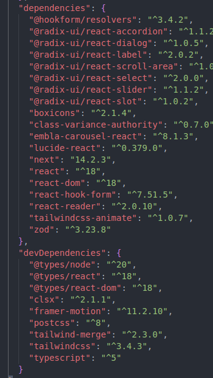
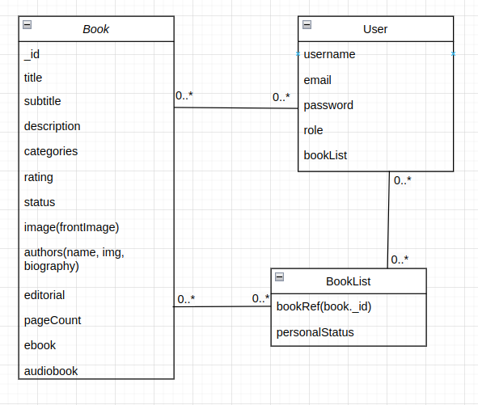
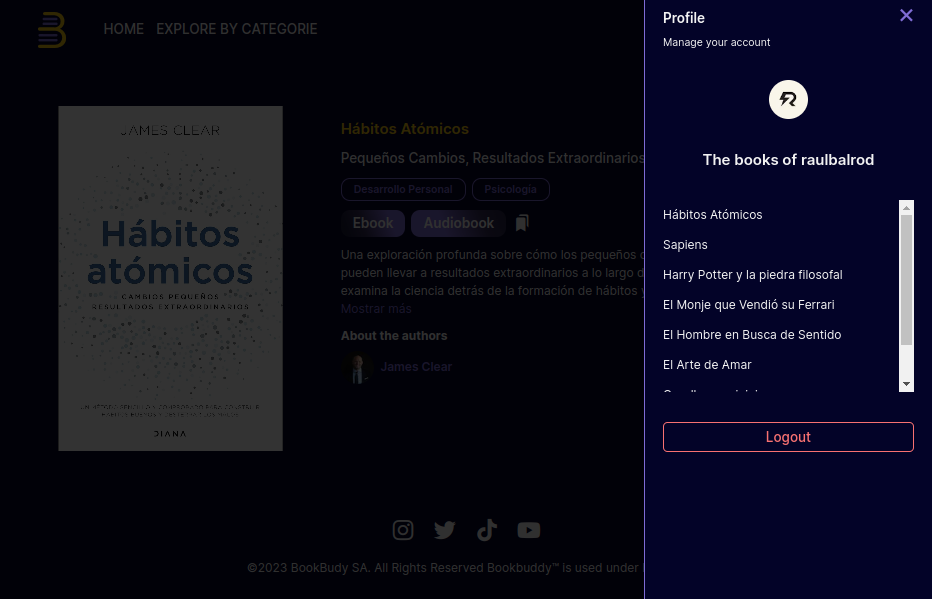

# Bookbuddy

Bookbuddy is an application that allows you to categorize books into lists. It helps you keep track of books you have read, want to read, or are currently reading. Additionally, if you are a premium user, you have access to read the ebook and listen to the audiobook.


# Table of Contents

- [Bookbuddy](#bookbuddy)
- [Table of Contents](#table-of-contents)
- [Technologies](#technologies)
- [File Structure](#file-structure)
- [Prerequisites](#prerequisites)
- [Installing](#installing)
- [Start](#start)
- [About the App](#about-the-app)
  - [Data Models](#data-models)
  - [Api Routes](#api-routes)
  - [Screenshots](#screenshots)
    - [Home Page](#home-page)
    - [Landing Page](#landing-page)
    - [My List Page](#my-list-page)
    - [Book Page](#book-page)
    - [Profile Popup](#profile-popup)
- [Contributing](#contributing)
- [BUGs or comments](#bugs-or-comments)
- [Version](#version)
- [Authors](#authors)


# Technologies
This project uses the following technologies:
- [Nexjts](https://nextjs.org/) as [App Router](https://nextjs.org/docs/app) whit [Typescript](https://www.typescriptlang.org/) and [Tailwind](https://tailwindcss.com/) for frontend.
- [Express](https://expressjs.com/) and [Node](https://nodejs.org/en/) for the backend.
- [MongoDB](https://www.mongodb.com/) for the database
  - Dependencies

| Frontend | Backend |
|---------|---------|
|  |  |


# File Structure

```
Bookbuddy
client
 ┣ 📂public # Public assets
 ┣ 📂src
 ┃ ┣ 📂app # Routes pages
 ┃ ┣ 📂components # All components
 ┃ ┣ 📂constants # Constants
 ┃ ┣ 📂contexts #Contexts
 ┃ ┣ 📂lib # Libraries
 ┃ ┣ 📂models  # Types for database data
 ┃ ┣ 📂types # Types for TypeScript
 ┃ ┣ 📂utils # Utilities
 ┃ ┣ 📜app.js  # Main app file
 ┃ ┗ 📜index.js # App launcher
 ┣ 📜next.config.mjs   
 ┣ 📜tailwind.config.ts  
 ┣ 📜tsconfig.json        
 ┣ 📜.gitignore         
 ┣ 📜package.json        
 ┣ 📜package-lock.json   
 ┗ 📜README.md    
📦docs
📦server
 ┣ 📂.vscode
 ┃ ┗ settings.json
 ┣ 📂src
 ┃ ┣ 📂config # Modules configurations
 ┃ ┣ 📂controllers # API controllers
 ┃ ┣ 📂loaders # Setup server and services on load
 ┃ ┣ 📂middlewares # API middlewares
 ┃ ┣ 📂openapi # Openapi (Swagger) specification
 ┃ ┣ 📂routes # API routes
 ┃ ┣ 📂services # API services
 ┃ ┣ 📂utils
 ┃ ┣ 📜app.js # App main
 ┃ ┗ 📜index.js # Launch app
 ┣ 📂postman
 ┃ ┣ 📂collections
 ┃ ┗ 📂environments
 ┣ 📜.editorconfig
 ┣ 📜.env
 ┣ 📜.env.template
 ┣ 📜.eslintrc.json
 ┣ 📜.gitignore
 ┣ 📜package-lock.json
 ┣ 📜package.json
 ┗📜README.md
```

# Prerequisites

- [MongoDB](https://gist.github.com/nrollr/9f523ae17ecdbb50311980503409aeb3)
- [Nodejs](https://nodejs.org/en/download/package-manager)
- [npm](https://nodejs.org/en/download/package-manager/)
  
You need to create a .env file on the server folder(if you will use locally) of the project and put your SECRET_KEY key like that:

```
SECRET_KEY=1234
```

# Installing

1. Fork, then download or clone the repo.

```
https://github.com/raulbalrod/bookbuddy.git
```

2. Make sure MongoDB service is running.
3. For the Back-end, install the dependencies once via the terminal.
```
cd server/
npm install
```
4. For the Front-end, install the dependencies once via the terminal.
```
cd client/
npm install
```

# Start
To deploy simply run the next commands:
```
cd client/
npm run dev
```
and
```
cd server/
npm start
```

# About the App
## Data Models

## Api Routes
```
// Api Books Routes
router.get("/", checkToken, getAllBooks);  
router.get("/landing", getAllBooks); 
router.get("/:id", checkRole, getBook);
router.post("/", isAdmin, createBookController); 
router.patch("/:id", isAdmin, updateBook); 
router.delete("/:id", isAdmin, deleteBookController); 
```

```
// Api Users Routes
router.post("/login", login);
router.post("/", isAdmin, createUserController);
router.post("/basicUser", createBasicUser);
router.post("/premiumUser", createPremiumUser);
router.patch("/:id/role", checkTokenOwnUser, changeRoleOfUser); 
router.get("/", isAdmin, getUsersController);
router.get("/me", checkToken, getUserMe); 
router.patch("/:id", checkTokenOwnUser, editUserController); 
router.delete("/:id", isAdmin, deleteUserController); 
```

```
// Api Mylist Routes
router.post("/:id/books", checkTokenOwnUser, myBookList); 
router.patch("/:id/book", checkTokenOwnUser, updateBookStatusController); 
router.get("/:username/books", checkToken, getUserBookListController); 
router.post("/:id/books/remove", checkTokenOwnUser removeBookFromListController);
```


## Screenshots
### Home Page

### Landing Page

### My List Page

### Book Page


### Profile Popup



# Contributing
Please feel free to send pull request if you want to contribute!

# BUGs or comments
[Create new Issues]() (preferred) or email me: [raulballesterorodriguez@gmail.com](mailto:raulballesterorodriguez@gmail.com)

# Version
1.0.0

# Authors
- Raúl Ballestero - Development - [raulbalrod](https://github.com/raulbalrod)